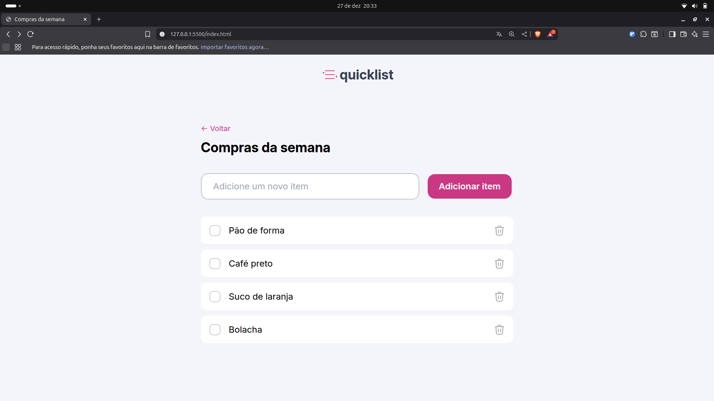
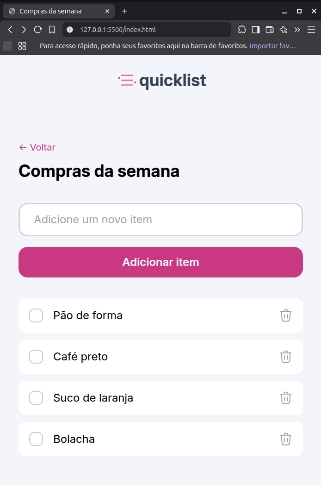
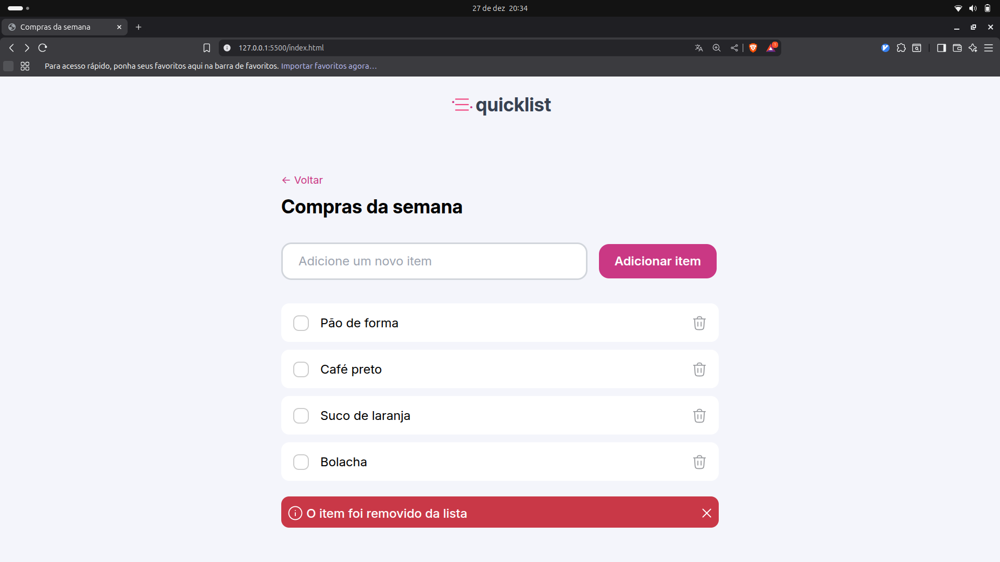
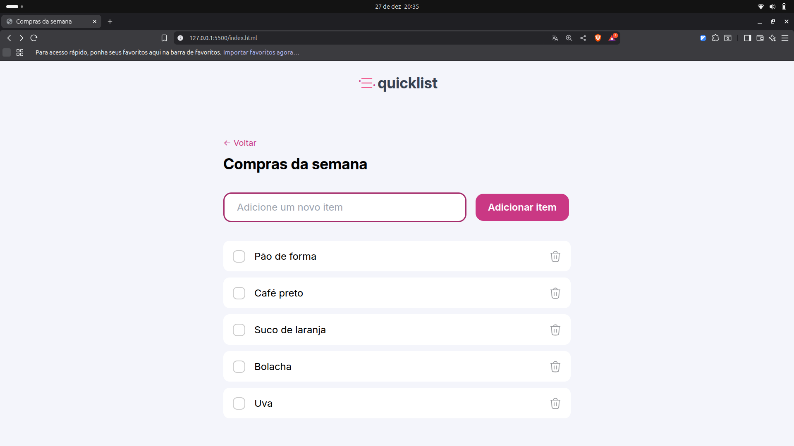

# QuickList

Uma aplicação web simples para criar e gerenciar listas de compras semanais. Permite adicionar itens, marcar como concluídos e remover itens da lista.

## Funcionalidades

- Adicionar novos itens à lista de compras
- Marcar itens como concluídos usando checkboxes
- Remover itens individualmente
- Notificação visual ao remover itens
- Interface responsiva e intuitiva

## Tecnologias Utilizadas

- **HTML5**: Estrutura da página
- **CSS3**: Estilização e layout responsivo
- **JavaScript**: Funcionalidade interativa

## Como Usar

1. Abra o arquivo `index.html` em qualquer navegador web moderno.
2. Digite o nome do item no campo "Adicione um novo item".
3. Clique em "Adicionar item" ou pressione Enter.
4. Use os checkboxes para marcar itens como concluídos.
5. Clique no ícone de lixeira para remover um item.

## Screenshots

Adicione aqui capturas de tela do projeto para ilustrar a interface e funcionalidades.






## Estrutura do Projeto

```
quicklist/
├── index.html      # Arquivo principal HTML
├── style.css       # Estilos CSS
├── script.js       # Lógica JavaScript
├── README.MD       # Este arquivo
├── img/            # Imagens e ícones
│   ├── logo.svg
│   ├── trash.svg
│   ├── alert.svg
│   └── remove.svg
└── screenShot/     # Capturas de tela do projeto
    ├── screenshot1.png
    ├── screenshot2.png
    ├── screenshot3.png
    └── screenshot4.png
```

## Contribuição

Contribuições são bem-vindas! Sinta-se à vontade para abrir issues ou enviar pull requests.

## Licença

Este projeto é de código aberto e está sob a licença MIT.
